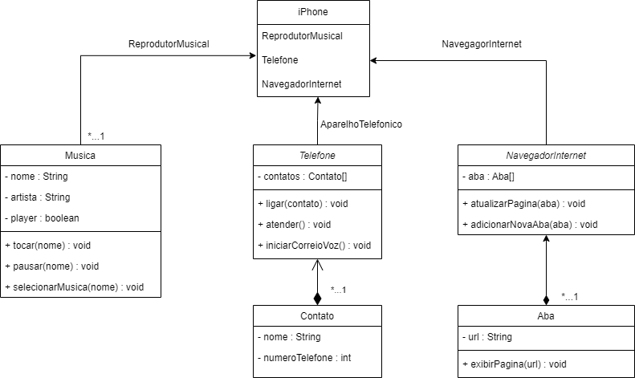

# desafio-dio-diagramacao-de-classes
Desafio Bootcamp DIO - Utilizando a Diagramação de Classes e Interfaces com a proposta de representar os papéis do iPhone de: Reprodutor Musical, Aparelho Telefônico e Navegador na Internet.

